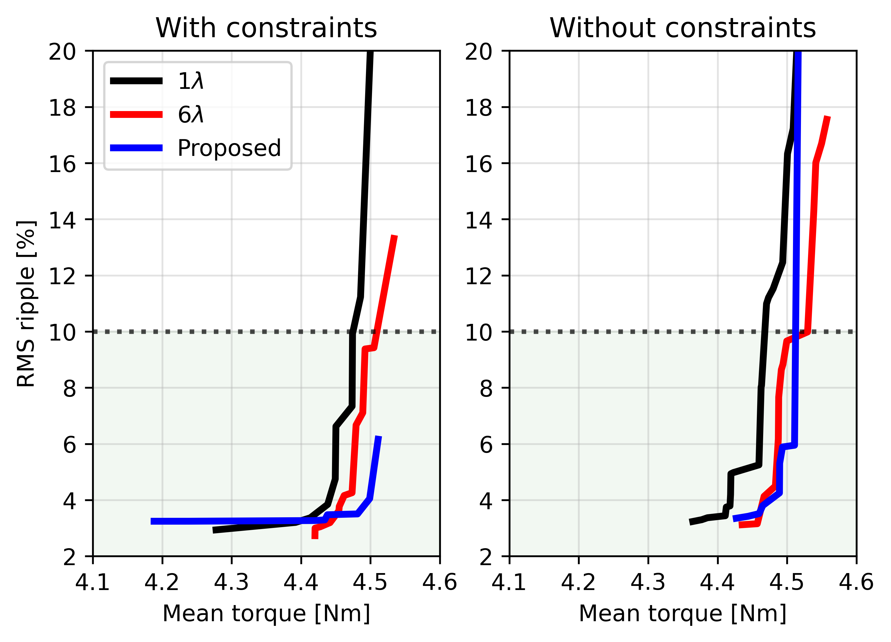

# MachineDesign

This repo contains Python code for automatic rotor design and optimization of synchronous reluctance machines (SynRMs).
The motivation is to improve the performance of SynRMs without using permanent magnets by optimizing the rotor flux barrier geometry. Candidate designs are generated in Python, simulated in Ansys Electronics Desktop, and optimized to increase the average torque and reduce torque ripple.

Run 'run.py' for random design evaluation and 'run_optimization.py' for Bayesian optimization. Ansys Electronics Desktop and PyAEDT are required.

## Citation

If you use this code, please cite our paper:
[Add citation here]